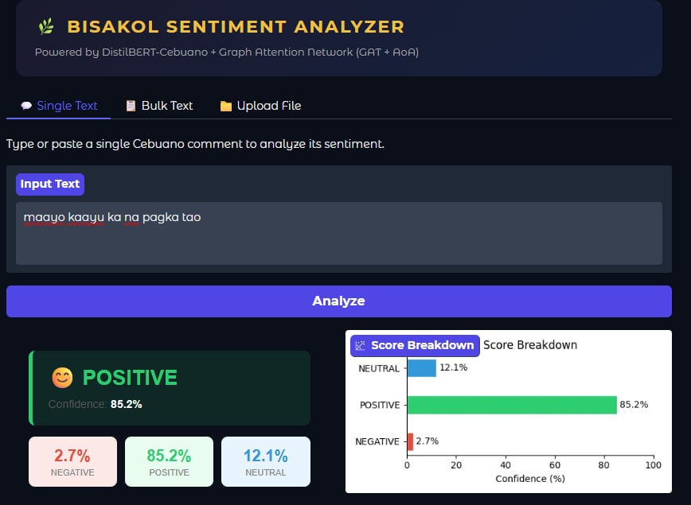
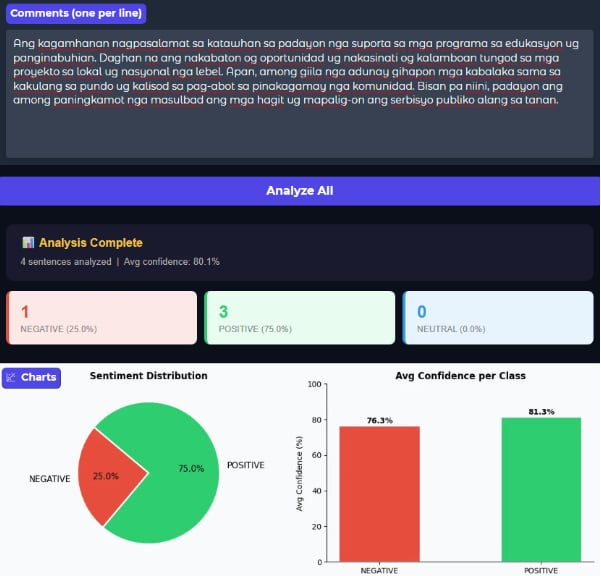

## Bisakol Sentiment Analyzer (Cebuano/Bisaya)

**Bisakol Sentiment Analyzer** is a Cebuano/Bisaya sentiment analysis project powered by **DistilBERT-Cebuano + Graph Attention Network (GAT) + Attention-over-Attention (AoA)**.  
It includes **Bisaya-only datasets**, **LICR-based preprocessing**, multiple **model experiments**, and a working **prototype web app** for single-text, bulk-text, and file-based sentiment analysis.

---

## Project Structure

- **`Datasets/`**
  - Contains the **Bisaya-only text datasets** used in this project (LICR datasets).
  - Note: Large dataset JSON files may be excluded from GitHub due to GitHub’s 100MB file limit.
- **`Data Preprocessing/`**
  - Notebooks/scripts for preprocessing the LICR dataset (cleaning, normalization, formatting for training/evaluation).
- **`Models/`**
  - Model training and experimentation notebooks for the approaches used in this project.
- **`Bisakol_Sentiment_Analysis_Prototype/`**
  - Prototype application for running sentiment predictions via UI.

---

## Datasets (Purely Bisaya Text)

This project uses datasets that contain **purely Bisaya/Cebuano text** (e.g., Cebuano comments) with sentiment labels.

- **LICR datasets**
  - `LICR_Bisakol_Dataset.json`
  - `LICR_Cebert_Dataset.json`

> If the dataset files are not present in the GitHub repo, they were likely kept locally or shared separately because of GitHub file size limits.
to view the file please proceed to this link = https://drive.google.com/drive/folders/1zZmSEgm862EexJUNFgDlfn7hgLjdUtwJ?usp=drive_link 
---

## Data Preprocessing (LICR)

Preprocessing follows a LICR-focused pipeline implemented in the notebook(s) under:

- `Data Preprocessing/` (e.g., `licr-data-preprocessing.ipynb`)

Typical steps included:
- Text cleaning (noise removal, spacing/punctuation handling)
- Normalization for Cebuano/Bisaya text
- Formatting into train/validation/test-ready structure
- Exporting processed outputs for model training and prototype inference

---

## Models Used

We experimented with **three transformer-based baselines** and our **main architecture**:

### Baseline Transformer Models
- **CeBERT (Cebuano BERT)**: Cebuano-focused BERT model used for sentiment classification experiments
- **mBERT**: Multilingual BERT baseline
- **XLM-RoBERTa**: Strong multilingual baseline

### Main Approach
- **DistilBERT-Cebuano + GAT + AoA**
  - Transformer produces contextual token/sequence representations
  - Graph Attention Network models relationships/features with attention
  - Attention-over-Attention (AoA) improves attention aggregation for classification

All training and experimentation artifacts are stored under `Models/`.

---

## Prototype Development

A working prototype UI was developed to demonstrate real-time sentiment analysis for Cebuano/Bisaya text.

### Prototype Features
- **Single Text**: Analyze one Cebuano comment
- **Bulk Text**: Analyze multiple comments at once (one per line)
- **Upload File**: Upload a file for batch sentiment analysis
- **Outputs**
  - Predicted sentiment (Positive/Negative/Neutral)
  - Confidence score
  - Score breakdown chart
  - Bulk analytics summary + distribution charts

### Prototype Screenshots

- Single text prediction + score breakdown:
  - `screenshots/single-text.png.jpg`
- Bulk text analysis (multiple sentences):
  -  `screenshots/bulk-text.png.jpg`
- Large batch analysis summary + distributions:
  - `screenshots/batch-text.png.jpg`
    
Then they will render in GitHub like this:




---

## How to Run (Prototype)

> Update these steps based on the framework you used (e.g., Streamlit/Flask/FastAPI).

1. Open `Bisakol_Sentiment_Analysis_Prototype/`
2. Install dependencies (if you have a `requirements.txt` inside the prototype folder):
   ```bash
   pip install -r requirements.txt
